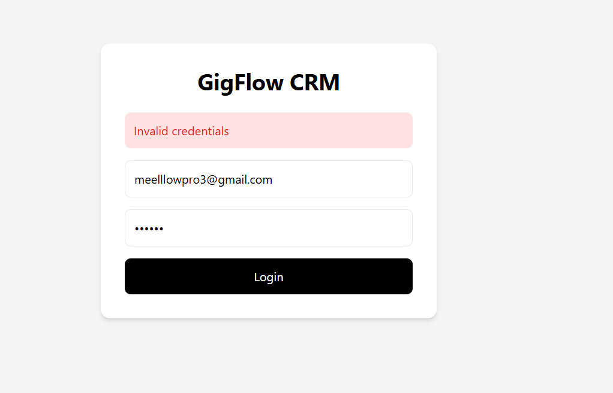
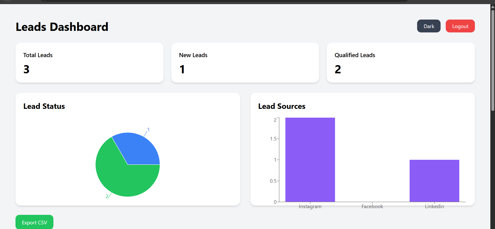
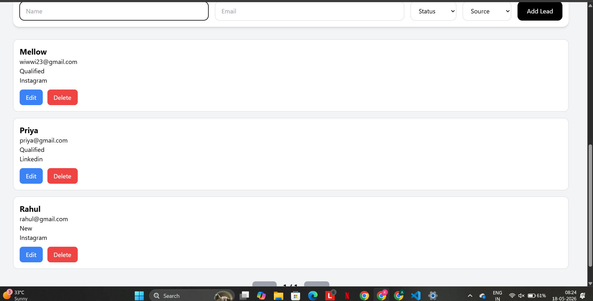
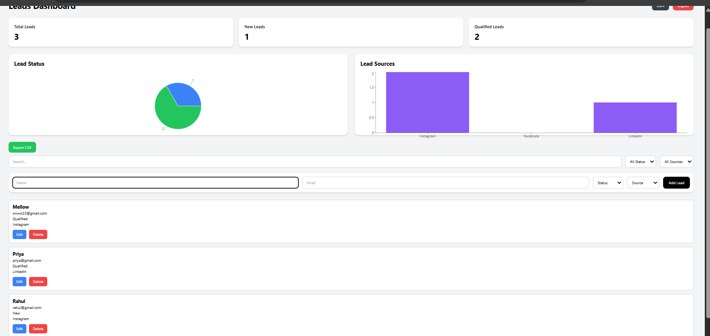

# GigFlow CRM
A mini CRM platform for managing sales leads.

Full-stack CRM application built with:

- React
- TypeScript
- Tailwind CSS
- Node.js
- Express
- MongoDB

## Features

- JWT Authentication
- Role-based Access
- CRUD Leads
- Charts & Analytics
- Debounced Search
- Filters
- Pagination
- CSV Export
- Dark Mode
- Docker Support

## Run Client

cd client
npm install
npm run dev

## Run Server

cd server
npm install
npm run dev

## Tech Stack
Frontend:
- React
- TypeScript
- TailwindCSS
- Vite

Backend:
- Node.js
- Express
- MongoDB
- JWT

## Live Demo
Frontend:
https://gigflow-crm.vercel.app

Backend:
https://gigflow-crm-backend.onrender.com

Demo Video: 
https://youtu.be/B2sAD8IRQdY
## Screenshots

### Login Page

### Dashboard

### Leads Management

### Charts & Analytics

